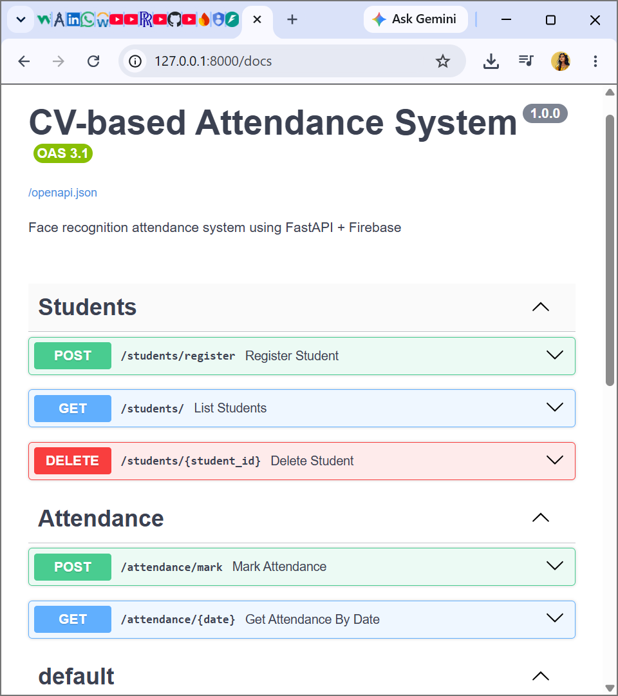
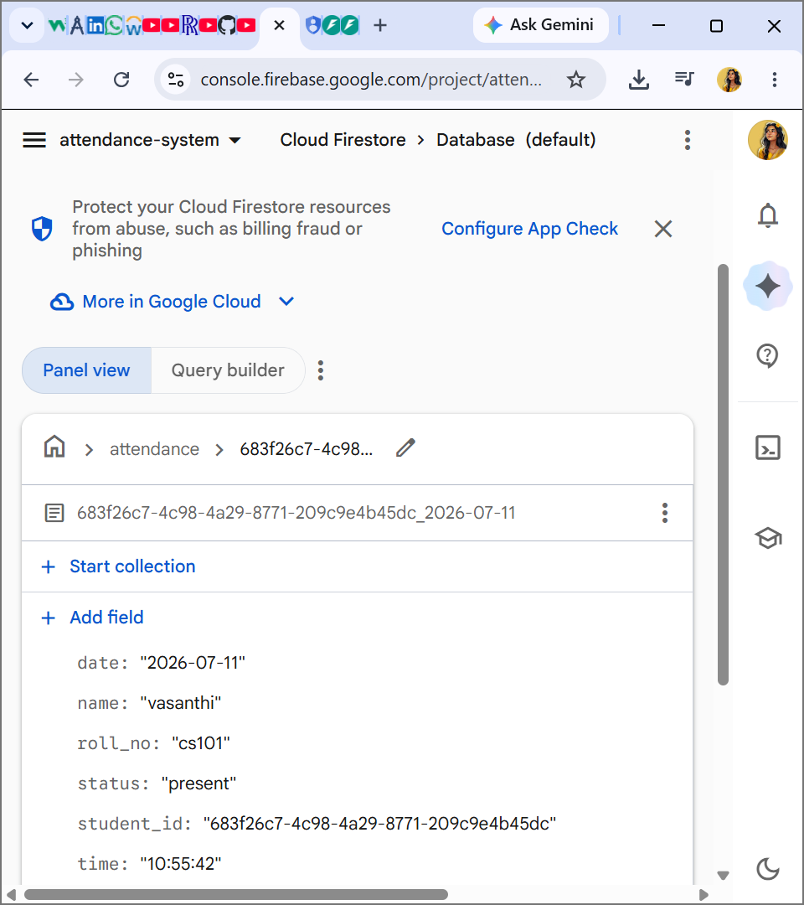

# CV-Based Face Recognition Attendance System

## Screenshots

**API Documentation (Swagger UI)**


**Live Attendance Data in Firestore**


A computer-vision + AI attendance system: a camera detects a student's face,
recognizes it against a database of registered faces, and marks attendance
automatically. Backend is **FastAPI**, database is **Firebase Firestore**,
face detection/recognition uses **face_recognition** (dlib) + **OpenCV**.

## Architecture

```
Camera / Webcam  --(JPEG frame)-->  FastAPI (/attendance/mark)
                                        |
                                        v
                         face_recognition: detect + encode face
                                        |
                                        v
                      Compare encoding vs Firestore "students" collection
                                        |
                                        v
                    Match found -> write to "attendance" collection (Firestore)
```

Two Firestore collections:
- **students**: `{ name, roll_no, encoding (128-d list of floats) }`
- **attendance**: `{ student_id, name, roll_no, date, time, status }`

---

## Step 1 — Install prerequisites

You need **Python 3.10 or 3.11** (dlib wheels are most reliable on these
versions) and **git**.

Check versions:
```bash
python3 --version
git --version
```

### `dlib` build tools (required by `face_recognition`)

`face_recognition` depends on `dlib`, which compiles C++ code. Install these
first, per OS:

**Windows:**
1. Install [CMake](https://cmake.org/download/) and add it to PATH.
2. Install "Desktop development with C++" via
   [Visual Studio Build Tools](https://visualstudio.microsoft.com/visual-cpp-build-tools/).
3. Restart your terminal after installing.

**macOS:**
```bash
brew install cmake
```

**Linux (Ubuntu/Debian):**
```bash
sudo apt-get update
sudo apt-get install -y build-essential cmake libopenblas-dev liblapack-dev
```

> If `pip install dlib` still fails, install a prebuilt wheel instead:
> `pip install dlib-binary` or search for a prebuilt wheel matching your
> Python version, as a fallback.

---

## Step 2 — Project setup

```bash
# Create the project folder (or clone your repo once you've pushed it)
mkdir attendance-system && cd attendance-system

# Create a virtual environment
python3 -m venv venv

# Activate it
source venv/bin/activate        # macOS/Linux
venv\Scripts\activate           # Windows

# Install dependencies
pip install -r requirements.txt
```

This installs: `fastapi`, `uvicorn`, `firebase-admin`, `face_recognition`,
`opencv-python`, `python-multipart`, `python-dotenv`, `numpy`, `pydantic`.

---

## Step 3 — Set up Firebase

1. Go to [Firebase Console](https://console.firebase.google.com/) → **Add project**.
2. Once created, go to **Build → Firestore Database → Create database**
   (start in **test mode** for development).
3. Go to **Project settings (gear icon) → Service accounts**.
4. Click **Generate new private key** → downloads a JSON file.
5. Rename it to `firebase-credentials.json` and place it in the project
   root (same folder as `requirements.txt`). This file is already in
   `.gitignore` so it will **never** be pushed to GitHub.
6. Copy `.env.example` to `.env`:
   ```bash
   cp .env.example .env
   ```
   The default values already point to `firebase-credentials.json`, so
   no edits are needed unless you rename the file.

> ⚠️ Never commit `firebase-credentials.json` or `.env` to GitHub — they
> contain secrets. The provided `.gitignore` already excludes them.

---

## Step 4 — Run the API

```bash
uvicorn app.main:app --reload
```

Server runs at `http://127.0.0.1:8000`.
Open the interactive Swagger docs at **http://127.0.0.1:8000/docs** — you
can test every endpoint from the browser without writing any client code.

---

## Step 5 — Register students

Using Swagger UI (`/docs`) → `POST /students/register`, or curl:

```bash
curl -X POST "http://127.0.0.1:8000/students/register" \
  -F "name=John Doe" \
  -F "roll_no=CS101" \
  -F "file=@/path/to/john_photo.jpg"
```

Use one clear, front-facing photo per student. Repeat for each student.

List registered students:
```bash
curl http://127.0.0.1:8000/students/
```

---

## Step 6 — Mark attendance via camera

Run the included webcam client (in a separate terminal, venv activated):

```bash
python camera_client.py
```

This opens your webcam, captures a frame every 3 seconds, sends it to
`POST /attendance/mark`, and overlays the recognition result on screen.
Press `q` to quit.

You can also test manually with curl using any photo:
```bash
curl -X POST "http://127.0.0.1:8000/attendance/mark" \
  -F "file=@/path/to/frame.jpg"
```

Each student is marked present **once per day** — sending the same face
again just returns "already marked present today."

---

## Step 7 — View attendance records

```bash
curl http://127.0.0.1:8000/attendance/2026-07-09
```
(Replace the date with `YYYY-MM-DD`.) You can also check the `attendance`
collection directly in the Firebase Console.

---

## Step 8 — Push the project to GitHub

```bash
cd attendance-system
git init
git add .
git status   # confirm firebase-credentials.json and .env are NOT listed
git commit -m "Initial commit: FastAPI + Firebase face recognition attendance system"

# Create a new empty repo on GitHub first (github.com/new), then:
git remote add origin https://github.com/<your-username>/<your-repo-name>.git
git branch -M main
git push -u origin main
```

Double-check `firebase-credentials.json` and `.env` never appear in
`git status` before committing — `.gitignore` handles this automatically,
but it's worth a manual check the first time.

---

## Project structure

```
attendance-system/
├── app/
│   ├── main.py                # FastAPI app + router registration
│   ├── config.py               # env variable loading
│   ├── firebase_config.py      # Firebase Admin SDK init
│   ├── face_utils.py           # face detection/encoding/matching (CV core)
│   ├── models.py                # Pydantic request/response schemas
│   └── routers/
│       ├── students.py         # register/list/delete students
│       └── attendance.py       # mark attendance, fetch by date
├── camera_client.py            # webcam capture -> sends frames to API
├── requirements.txt
├── .env.example
├── .gitignore
└── README.md
```

## API summary

| Method | Endpoint                  | Description                          |
|--------|----------------------------|---------------------------------------|
| POST   | `/students/register`       | Register a student (name, roll_no, photo) |
| GET    | `/students/`                | List all students                    |
| DELETE | `/students/{student_id}`   | Remove a student                     |
| POST   | `/attendance/mark`         | Send a frame, mark attendance if matched |
| GET    | `/attendance/{date}`       | Get attendance for a given date      |

## Notes / things to mention in your project report

- **Face encoding**: each face is converted into a 128-dimension vector via
  a ResNet-based model inside `dlib`/`face_recognition`. Matching is done
  via Euclidean distance between vectors (`FACE_MATCH_TOLERANCE` in `.env`
  controls strictness — lower = stricter).
- **Why Firestore**: NoSQL, real-time, easy to query by date, no server
  setup needed, free tier is enough for a college project.
- **Possible extensions**: liveness detection (to prevent photo spoofing),
  multiple camera support, a simple React/HTML dashboard to view attendance,
  email/SMS notification on absence, group-photo attendance using
  `get_all_face_encodings()`.
